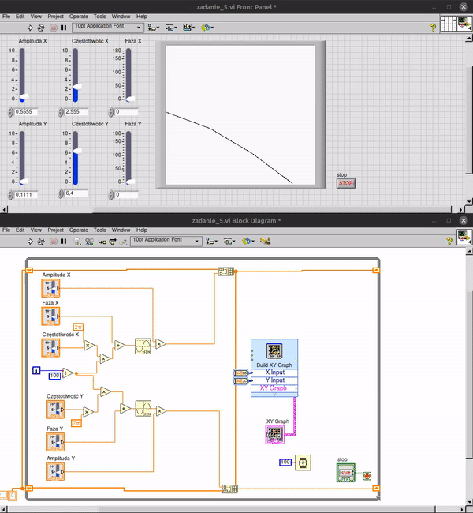
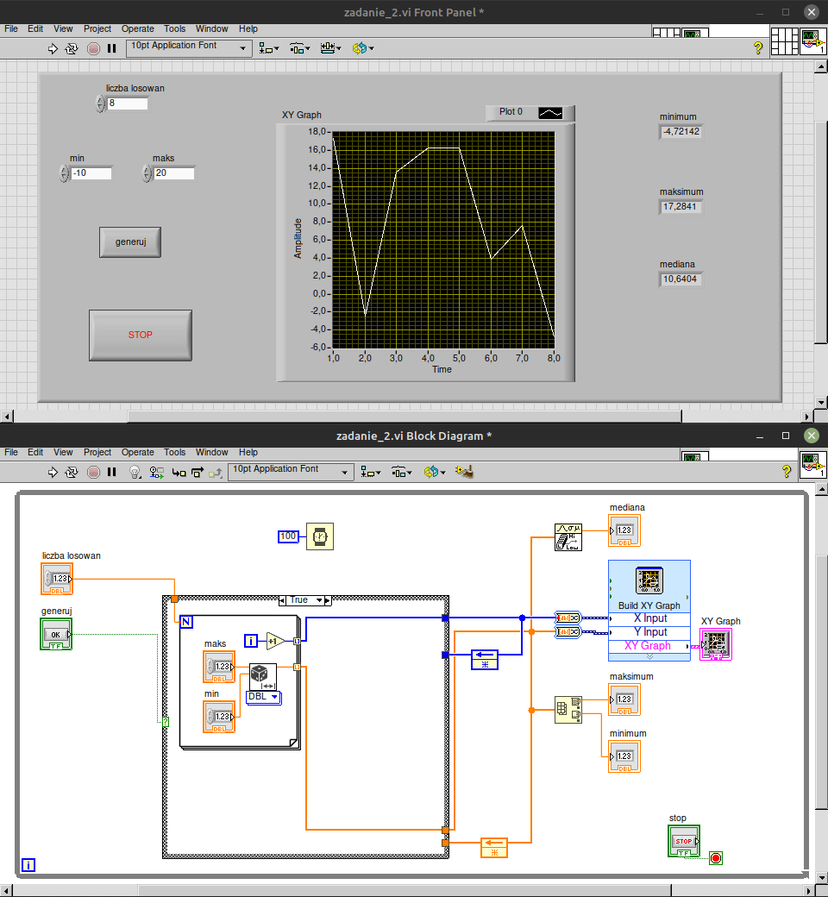
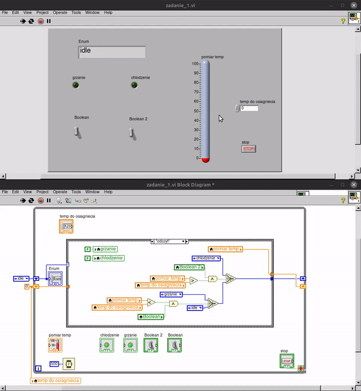

# UNI-LabVIEW-in-Measurements  

This repository features my solved exercises from the **"Application of LabVIEW environment in measurements"** course that I took at University of Wrocław.  

It consists of many useful LabView controlling systems that I created during the semester.  

Below you can find the ones that I liked the most:  
- [zadanie_5.vi - Create Lissajous figures](https://github.com/tTargiel/UNI-LabVIEW-in-Measurements/blob/main/Lista%2001/zadanie_5.vi)  
  

- [zadanie_2.vi - Draw random numbers in range; show min, max and median](https://github.com/tTargiel/UNI-LabVIEW-in-Measurements/blob/main/Lista%2004/zadanie_2.vi)  
  

- [zadanie_1.vi - Automatic heating unit](https://github.com/tTargiel/UNI-LabVIEW-in-Measurements/blob/main/Lista%2010/zadanie_1.vi)  
  